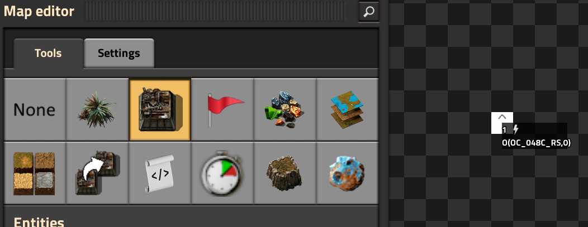

# Making a Thing

In this brief tutorial, we will be creating a custom entity, registering it as a Thing, and seeing it built in-game.

:::info
Knowledge of basic Factorio modding is assumed in this tutorial. If you are looking for an introduction to modding or are unable to follow what is happening in this tutorial, please consult Factorio's many modding resources, such as [this modding tutorial](https://wiki.factorio.com/Tutorial:Modding_tutorial/Gangsir).
:::

For the purposes of this tutorial, we will assume you are working on a mod called `my-mod` and have built out a suitable mod skeleton for extension.

## Data Phase

### Custom Entity

We will begin by creating a simple custom entity that will become our new Thing. This one is based on the `simple-entity-with-owner` prototype. You will need the following entity sprite graphic, as well as a `white.png` file for the icon, loaded into your graphics folder:


Add the following definitions to your `data.lua`:
:::info
Be sure to modify as appropriate for your actual mod name, graphics, etc.
:::
```lua
local entity_sprite = {}
for idx, direction in pairs({ "north", "east", "south", "west" }) do
	---@type data.Sprite
	entity_sprite[direction] = {
		filename = "__my-mod__/graphics/entity-sprite.png",
		width = 128,
		height = 128,
		scale = 0.25,
		x = (idx - 1) * 128,
		shift = util.by_pixel(0, 0),
	}
end

---@type data.SimpleEntityWithOwnerPrototype
local entity = {
	-- PrototypeBase
	type = "simple-entity-with-owner",
	name = "my-mod-thing",

	-- SimpleEntityWithOwnerPrototype
	render_layer = "floor-mechanics",
	picture = entity_sprite,

	-- EntityWithHealthPrototype
	max_health = 250,
	dying_explosion = "medium-explosion",
	corpse = "medium-remnants",

	-- EntityPrototype
	icon = "__my-mod__/graphics/white.png",
	icon_size = 256,
	collision_box = { { -0.45, -0.45 }, { 0.45, 0.45 } },
	collision_mask = {
		layers = {
			item = true,
			object = true,
			player = true,
			water_tile = true,
		},
	},
	selection_box = { { -0.5, -0.5 }, { 0.5, 0.5 } },
	flags = {
		"player-creation",
		"placeable-neutral",
		"not-upgradable",
	},
	minable = { mining_time = 1, result = "my-mod-thing" },
	selection_priority = 20,
}

---@type data.ItemPrototype
local item = {
	-- Prototype Base
	type = "item",
	name = "my-mod-thing",
	place_result = "my-mod-thing",

	-- ItemPrototype
	stack_size = 50,
	icon = "__my-mod__/graphics/white.png",
	icon_size = 256,
	order = "m",
	subgroup = "circuit-network",
}

data:extend({entity, item})
```
Boot into a Factorio editor scenario and you should now have a placeable custom entity. Now to make it into a Thing.

### Thing Definition

To define a Thing, we use the `mod-data` mechanism to provide information about our Thing and its desired behaviors. Add the following code to the bottom of our `data.lua` file:

```lua
---@type things.ThingRegistration
local my_thing_registration = {
	name = "my-mod-thing",
	intercept_construction = true,
}

data.raw["mod-data"]["things-names"].data["my-mod-thing"] = my_thing_registration
```

This code is adding an entry to Things' `mod-data` table explaining how it should manage your new Thing. In this case, we are simply passing in the name of your custom entity, along with the `intercept_construction` option. This option will cause Things to intercept any event where a user-initiated action would build your custom entity, and make the built entity into a Thing.

:::info
Thing registration is the primary interface for customizing the behavior of your Thing. Numerous options are available when registering a Thing. See the [things.ThingRegistration reference](../reference/types#thingsthingregistration) for more information.
:::

### In-Game Test

1) Launch Factorio with your new mod and Things both enabled.
2) Create a new blank map or Editor Extensions testing scenario.
3) Enable `Debug mode` in Things' map settings.
:::info
In debug mode, Things will draw rendering overlays to show you some information about the state of your Things. It will also output a considerable amount of information to Factorio's log file.
:::
4) Launch the map editor.
5) Build your new entity.

You should see something like this:



If so, congratulations! You've successfully made your first Thing. Now we'll move on to more advanced functionality.

:::note
If you see the placed entity, but not the debug overlay, make sure you have Things debug mode enabled in map-level mod settings.
:::


